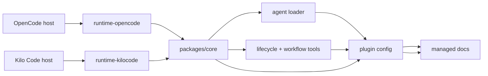
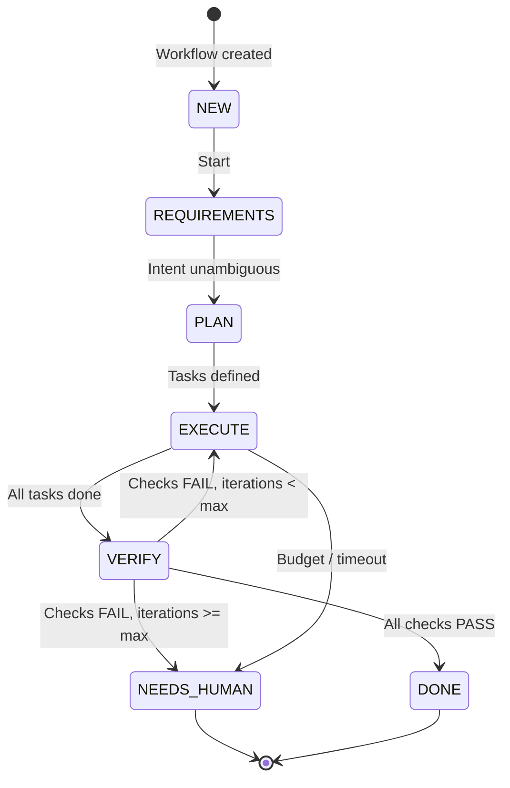

# Architecture

`tori-agent` is a shared agent stack with thin runtime wrappers.
`packages/core` owns the shared behavior, while OpenCode and Kilo Code only adapt that core plugin to their host SDKs.

## System diagram

## Components and responsibilities

- `packages/core` — source of truth for shared logic, agent specs, prompts, and plugin assembly.
- `packages/core/src/plugin/index.ts` — builds the plugin object via `buildPlugin()`.
- `packages/core/src/codegen/loader.ts` — loads YAML agent specs from `packages/core/spec/agents/*.yaml` and prompt files from `packages/core/spec/prompts/**`.
- `packages/core/src/tools/lifecycle.ts` — provides lifecycle functions for artifact management (specs, exec-plans, briefs).
- `packages/core/src/tools/workflow.ts` — provides workflow state management (stage transitions, task/check recording).
- `packages/core/src/plugin/tools.ts` — wraps lifecycle and workflow functions as runtime-callable tools.
- `packages/core/src/plugin/agents.ts` — injects compiled agents into host config.
- `packages/runtime-opencode/src/index.ts` and `packages/runtime-kilocode/src/index.ts` — thin wrappers that export `buildPlugin()` from core.
- `packages/runtime-opencode/src/sdk-adapter.ts` and `packages/runtime-kilocode/src/sdk-adapter.ts` — normalize `serverUrl` into `{ baseUrl: new URL(serverUrl) }`.
- `packages/cli` — currently a stub, not a production runtime path.
- `docs/specs`, `docs/exec-plans`, `docs/briefs`, `docs/workflows` — managed repo artifacts.

## Workflow model

The core behavior is a deterministic state machine:

### States

| State | Meaning |
|-------|---------|
| `NEW` | Workflow not started |
| `REQUIREMENTS` | Gathering intent, resolving ambiguities |
| `PLAN` | Decomposing into tasks |
| `EXECUTE` | Running tasks |
| `VERIFY` | Running verification checks |
| `DONE` | Workflow complete |
| `NEEDS_HUMAN` | Blocked, requires user intervention |

### Guards

- Max verify iterations: **2**
- Task budget: **250k tokens** or **20 tool calls**
- Task timeout: **20 minutes**
- Max delegation depth: **1** (Tori → Specialist)

## Startup and runtime flow

1. A host runtime loads either runtime wrapper package.
2. The wrapper passes control to `buildPlugin()` in `packages/core`.
3. `buildPlugin()` resolves the project root, loads agents and tools, and assembles the plugin object.
4. The loader reads agent YAML and prompt files from the core spec directories.
5. Lifecycle and workflow tooling is wrapped into runtime-callable tools, and compiled agents are injected into host config.
6. On `session.created`, the plugin bootstraps the managed docs artifact directories.

## Constraints and gotchas

- `packages/core` is authoritative for shared behavior.
- Runtime packages should remain thin adapters.
- `packages/cli` is not a production entrypoint.
- Do not edit generated `dist/` output.
- Managed docs artifacts live under `docs/specs`, `docs/exec-plans`, `docs/briefs`, and `docs/workflows`.
