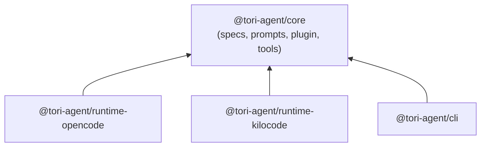
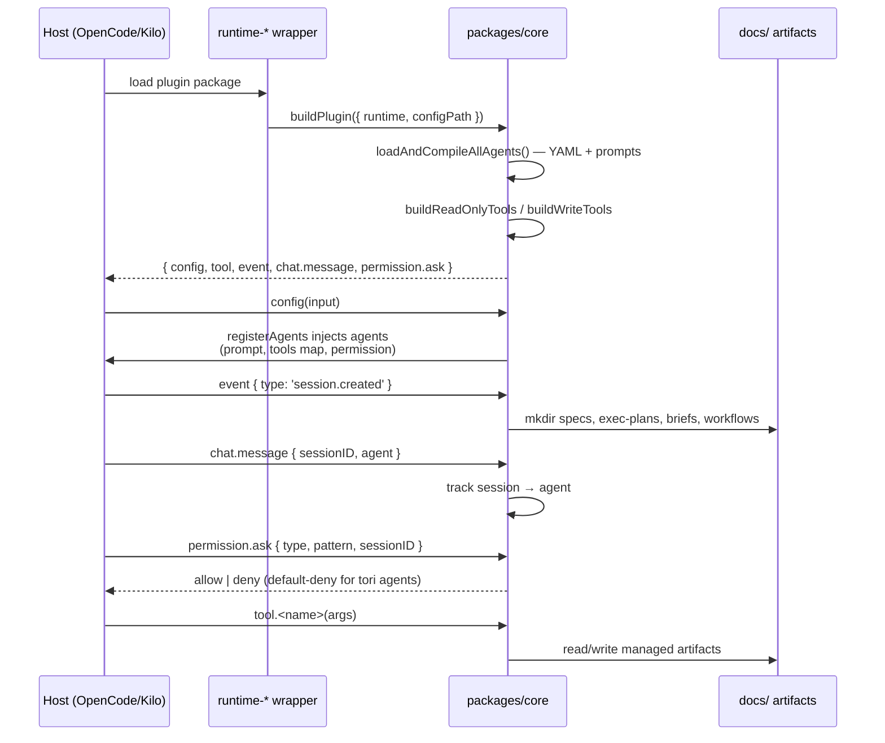
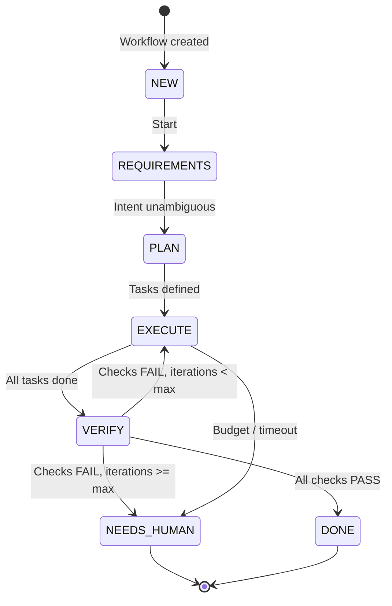

# Architecture

`tori-agent` is a shared agent stack with thin runtime wrappers.
`packages/core` owns all shared behavior — agent specs, prompts, permissions, tools, and plugin assembly — while the OpenCode and Kilo Code packages only adapt that core to their host SDKs.

Design principles:

- **Core is authoritative.** If logic can live in `packages/core`, it lives there. Runtime packages contain no behavior beyond SDK adaptation.
- **Specs, not code.** Agents are declared in YAML and expanded at load time; adding an agent never requires touching TypeScript.
- **Default-deny permissions.** Every agent starts from `"*": "deny"` and must explicitly allow each capability.
- **Deterministic bookkeeping.** Lifecycle and workflow state changes go through mechanical tools, not LLM free-writing.

## Monorepo layout

npm workspaces monorepo, four packages:



| Package | Role | Published files |
|---------|------|-----------------|
| `packages/core` | Source of truth: agent specs, prompts, plugin builder, lifecycle/workflow tools | `dist/`, `spec/` |
| `packages/runtime-opencode` | Thin adapter: exports `buildPlugin()` for the OpenCode host | `dist/`, `opencode.json` |
| `packages/runtime-kilocode` | Thin adapter: exports `buildPlugin()` for the Kilo Code host | `dist/`, `kilo.json` |
| `packages/cli` | `generate` command (expand agent specs to disk), `config` command; `serve`/`doctor` unimplemented | `dist/` |

**Build order matters.** Runtimes and CLI import from `@tori-agent/core`, which resolves to `dist/`. `npm run build` compiles core first, then both runtimes. The CLI is built separately (`npm run build -w packages/cli`).

## Plugin assembly pipeline

`buildPlugin()` (`packages/core/src/plugin/index.ts`) is the single entry point. Each runtime calls it with its detected `runtime` and `configPath`, producing a host plugin function:

```typescript
export interface PluginInput {
  directory?: string;      // working directory (default '.')
  worktree?: string;       // takes precedence over directory for projectRoot
  serverUrl?: string | URL;
  runtime?: 'opencode' | 'kilocode';
  configPath?: string;     // AGENTS.md path for human-tone injection
}
```

Assembly order inside the returned plugin function:

1. **Resolve `projectRoot`** — `worktree` wins over `directory` (unless `worktree === '/'`).
2. **Fix artifact paths** — runtime-managed directories (`.opencode/specs`, `.opencode/plans`, `.opencode/briefs`, `.opencode/workflows` for OpenCode; `.kilocode/...` for Kilo Code).
3. **`loadAndCompileAllAgents()`** — read all YAML specs, expand personas/modes into `CompiledAgent[]`.
4. **`buildReadOnlyTools()` / `buildWriteTools()`** — wrap lifecycle/workflow functions as host-callable tools.
5. **Return the hook object** the host SDK expects.

The returned hooks (see [Permission model](#permission-model) for the last two):

| Hook | Purpose |
|------|---------|
| `config(input)` | Injects compiled agents into host config via `registerAgents()` |
| `tool` | Registry of read-only + write tools |
| `event` | On `session.created`, creates the four `docs/` artifact directories |
| `chat.message` | Tracks session → agent mapping for permission adjudication |
| `permission.ask` | Call-time permission decisions for tori agent sessions |

## Agent specification format

Agents are declared in `packages/core/spec/agents/*.yaml` and loaded by `packages/core/src/codegen/loader.ts`.

```yaml
id: scribe
name: Scribe
mode: subagent            # 'subagent' | 'all'
color: info
temperature: 0.1
human_tone: false         # append human-tone.md + AGENTS.md content (mode 'all' only)
description: "Stage artifact generator. ..."
prompt: prompts/scribe.md # base prompt, relative to spec/
modes:                    # or 'personas' — each entry spawns a separate agent
  documentation:
    description: "Write README and user-facing documentation"
    instructions: prompts/scribe/documentation.md
    # permissions: ...    # optional per-mode overrides, merged over base
permissions:
  allow: [read, write, edit, bash, mark_block_done, complete_plan, register_spec, glob, grep, question]
  deny: []                # explicit denies win over allows
  allow_paths: {}         # per-tool path scoping: { edit: ["docs/**"] }
  allow_commands: {}      # per-tool command scoping: { bash: ["npm *"] }
```

TypeScript contract (`packages/core/src/codegen/types.ts`):

```typescript
interface AgentSpec {
  id: string;
  name: string;
  mode: 'all' | 'subagent';
  color?: string;
  temperature: number;
  description: string;
  prompt: string;
  human_tone: boolean;
  permissions: AgentPermissions;
  personas?: Record<string, PersonaEntry>;  // alias: modes
  modes?: Record<string, PersonaEntry>;
}

interface CompiledAgent {
  id: string;               // 'scribe' or 'scribe:documentation' after expansion
  description: string;
  temperature: number;
  mode: 'all' | 'subagent';
  color: string;
  prompt: string;           // fully composed prompt
  permission: Record<string, unknown>;  // compiled permission record
  humanTone?: boolean;
}
```

**Persona/mode expansion.** A spec with `personas`/`modes` produces one `CompiledAgent` per entry, with id `<spec>:<key>` (e.g. `scribe:documentation`). A spec without them compiles to a single agent. Current expansion: 3 specs → 11 agents (verified by `packages/core/tests/verify-expansion.mjs`).

## Prompt composition

Prompts are markdown files under `packages/core/spec/prompts/`, composed at load time:

```
spec.prompt (e.g. prompts/scribe.md)
  + "\n\n"
  + persona instructions (e.g. prompts/scribe/documentation.md)   [per expanded agent]
  + "\n\nInstructions from: <configPath>\n" + human-tone.md       [mode 'all' + human_tone only]
```

- Missing prompt file → agent is skipped with a warning (`null` from `compileAgent`).
- `loadHumanTone()` returns `''` if `prompts/human-tone.md` is absent, disabling injection silently.
- The `<configPath>` line points at the host's `AGENTS.md`, so the agent treats repo-level instructions as part of its prompt.

## Permission model

Default-deny: `buildPermissions()` starts every agent from `{ "*": "deny" }` and layers explicit rules on top.

### Compile-time (spec → permission record)

| YAML field | Compiles to | Example |
|------------|-------------|---------|
| `allow: [read]` | `{ read: "allow" }` | tool fully allowed |
| `deny: [bash]` | `{ bash: "deny" }` | tool fully denied |
| `allow_paths: { edit: ["docs/**"] }` | `{ edit: { "*": "deny", "docs/**": "allow" } }` | path-scoped |
| `allow_commands: { bash: ["npm *"] }` | `{ bash: { "*": "deny", "npm *": "allow" } }` | command-scoped |

Persona/mode `permissions` merge over the base spec via shallow spread (`mergePermissions`), so a mode can widen or narrow the base.

### Registration-time (core → host config)

`registerAgents()` (`packages/core/src/plugin/agents.ts`) translates each compiled permission record into the **host-native** shapes the SDK actually enforces (`AgentConfig` in `@kilocode/sdk` / opencode):

1. **`tools: { [name]: boolean }`** — built by `buildToolsMap()`. This map is what controls tool availability in the spawned agent's tool list. `true` allows all patterns, `false` removes the tool. Without it, host built-ins (`write`, `edit`, `bash`) never reach subagents regardless of what the YAML allows.
2. **`permission`** — reshaped by `buildHostPermission()`: the `"*": "deny"` catch-all is dropped (default-deny moves to call time), host-schema keys (`edit`, `bash`, `webfetch`, ...) are populated, and `write: allow` implies `edit: allow` because the host gates file-writing built-ins under `edit`.
3. **User overrides** — per-agent config from the host merges over compiled values (deep merge for objects, replace for scalars).

**Inheritable-deny omission.** When the host's `task` tool spawns a subagent, it derives the child session's permission from the *caller's* ruleset: any wildcard deny the caller holds on `edit`, `bash`, `notebook_edit`, `notebook_execute` (or MCP-prefixed tools) is force-inherited into the child, where it **overrides the subagent's own allows**. The host's `write` tool rides under the `edit` permission. Because Tori's spec denies `edit`/`write`/`bash`, advertising those denies to the host would strip them from every subagent Tori spawns. `buildToolsMap()` and `buildHostPermission()` therefore **omit wildcard denies for that inheritable set** (`HOST_INHERITABLE_DENY_TOOLS`); Tori's own discipline for those tools is enforced at call time instead (below). Denies on non-inheritable tools (e.g. `mark_block_done`) are still advertised normally.

### Call-time (`permission.ask` hook)

When the host asks "may this session run this tool?", the plugin adjudicates:

```mermaid
flowchart TD
    A[permission.ask fired] --> B{session tracked<br/>via chat.message?}
    B -- no --> Z[hook stays silent<br/>host default applies]
    B -- yes --> C{agent found in<br/>CompiledAgent[]?}
    C -- no --> Z
    C -- yes --> D[evaluatePermission:<br/>exact tool key,<br/>write↔edit alias,<br/>pattern matching]
    D --> E["status = allow | deny"]
```

- Only sessions running a tori agent are adjudicated; anything else keeps host behavior.
- Pattern-scoped rules (`allow_paths`/`allow_commands`) are evaluated against the request pattern, **last match wins**, mirroring host semantics.
- Unlisted tools deny by default — the `"*": "deny"` intent is preserved at the point of use instead of by stripping tools.

## Tool system

Tools are built per plugin invocation, bound to `projectRoot` and the artifact paths (`packages/core/src/plugin/tools.ts`).

| Category | Tools | Used by |
|----------|-------|---------|
| Read-only | `project_state`, `check_artifacts`, `run_mechanical_checks`, `workflow_state` | Tori directly (zero-LLM-cost bookkeeping) |
| Write | `mark_block_done`, `complete_plan`, `register_spec`, `transition_stage`, `record_task_result`, `record_check_result` | Delegated to Scribe per Tori's prompt |
| File write | `write` | Generic file creation, sandboxed by `resolveArtifact()` |

All tools return JSON strings and never throw — errors are captured as `{ "error": "..." }`.

**Path confinement.** The `write` tool resolves every target against `projectRoot` and rejects paths escaping it (`resolveArtifact()`), so agents cannot write outside the project even if the host grants them the tool.

**Mechanical checks.** `runMechanicalChecks` (`packages/core/src/tools/lifecycle.ts`) parses the `## Review Checks` section of the repo's `AGENTS.md` and executes the declared commands (lint, then tests). This keeps the pre-review filter config-driven — edit `AGENTS.md`, not code.

## Data flow



## Workflow model

The core behavior is a deterministic state machine (`packages/core/src/tools/workflow.ts`):



### States

| State | Meaning |
|-------|---------|
| `NEW` | Workflow not started |
| `REQUIREMENTS` | Gathering intent, resolving ambiguities |
| `PLAN` | Decomposing into tasks |
| `EXECUTE` | Running tasks |
| `VERIFY` | Running verification checks |
| `DONE` | Terminal — workflow complete |
| `NEEDS_HUMAN` | Terminal — blocked, requires user intervention |

Transitions are validated by `transition_stage` — invalid jumps are rejected. Entering `VERIFY` from `EXECUTE` resets the check list; returning to `EXECUTE` increments the iteration counter. Task and check results are appended to the workflow file via `record_task_result` / `record_check_result`.

### Guards

- Max verify iterations: **2**
- Task budget: **250k tokens** or **20 tool calls**
- Task timeout: **20 minutes**
- Max delegation depth: **1** (Tori → Specialist)

## Configuration and runtime detection

**Runtime detection** (`packages/core/src/runtime/detect.ts`): `TORI_RUNTIME` env var → `process.argv` heuristic (`opencode`/`kilocode`) → default `opencode`.

**Config path resolution** (per runtime wrapper, used for human-tone injection):

- OpenCode: `.opencode/AGENTS.md` → `~/.config/opencode/AGENTS.md`
- Kilo Code: `.kilo/AGENTS.md` → `.kilocode/AGENTS.md` → `~/.config/kilocode/AGENTS.md` → `~/.config/kilo/AGENTS.md`

**Host plugin registration** — each runtime package ships a config file (`opencode.json` / `kilo.json`) declaring:

```json
{
  "plugin": ["@tori-agent/core", "@tori-agent/runtime-kilocode"],
  "default_agent": "tori"
}
```

**Generated agent files.** `node packages/cli/dist/cli.js generate` expands all specs to `.kilo/agents/*.json` (or `.opencode/agents/`), including the compiled prompt, the host-native `tools` map, and the reshaped permission. Formats: `json` (default), `yaml`, `md`; the index manifest is always `index.json`.

## Build system

- **TypeScript**: ES2022 target, `NodeNext` modules, strict mode, project references (runtimes + CLI → core). Shared config in `tsconfig.base.json`.
- **Scripts** (root `package.json`): `npm run build` (core + runtimes), `npm run lint`, `npm test` (currently no `*.test.js` files — verification is `verify-expansion.mjs`).
- **ESLint** (`eslint.config.js`): flat config with a custom rule enforcing the `node:` protocol on Node.js built-in imports (`import fs from "node:fs"`). Applies to `packages/*/src/`.
- **`dist/` is build output** — never edit or commit.

## Constraints and gotchas

- `packages/core` is authoritative for shared behavior; runtime packages stay thin adapters.
- `packages/cli` is not a production entrypoint (`serve`/`doctor` unimplemented).
- **Subagent tool availability is controlled by the `tools` map**, not by permission keys alone. A spec that allows `write` but produces no `tools: { write: true }` entry spawns a subagent without the tool. Keep `buildToolsMap()` in sync when adding new capability keys.
- **Caller wildcard denies on `edit`/`bash`/`write`/`notebook_*` are force-inherited into subagent sessions** by the host's task tool and override the subagent's own allows. Never emit those denies in the host-facing config (`HOST_INHERITABLE_DENY_TOOLS`); enforce them at call time via `permission.ask` instead. If a subagent reports built-in tools as "unavailable" while its plugin tools work, this inheritance is the first thing to check.
- `write: allow` in a spec must keep implying `edit: allow` (`buildHostPermission`) — the host gates its file-writing built-ins under `edit`.
- The `permission.ask` adjudicator only covers sessions it has seen via `chat.message`. Untracked sessions fall through to host defaults by design.
- Managed artifacts (`.opencode/specs`, `.opencode/plans`, `.opencode/briefs`, `.opencode/workflows` for OpenCode; `.kilocode/...` for Kilo Code) are created on `session.created` and manipulated only through lifecycle/workflow tools — don't hand-edit them.
- `npm test` currently fails because no `.test.js` files exist; the real verification flow is build → verify-expansion.
