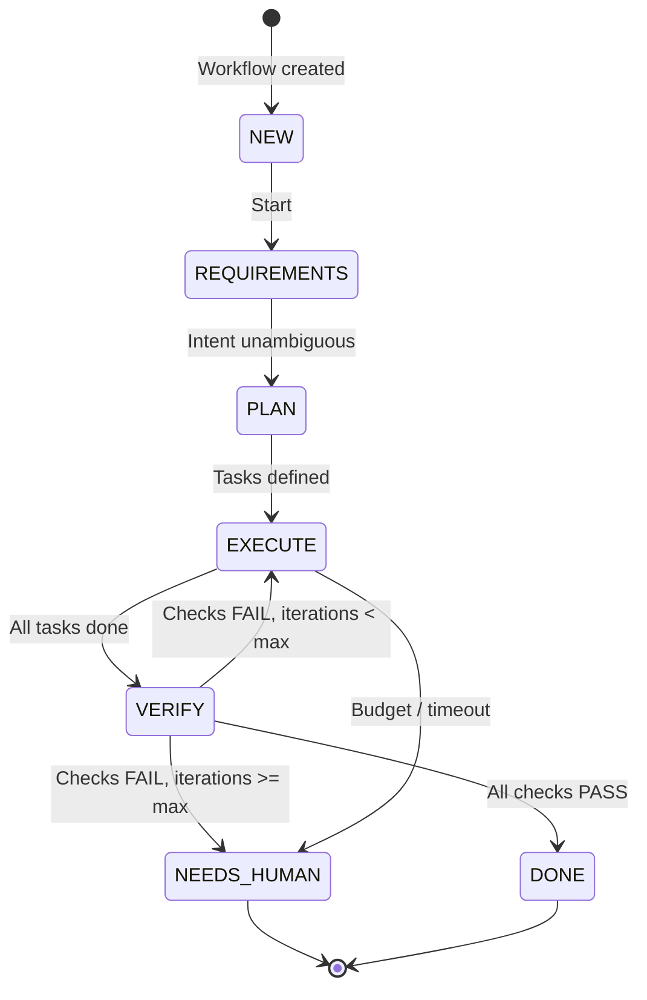

# Contributing to tori-agent

Thanks for your interest in contributing. This document explains the project's architecture, workflow model, and development conventions so contributions stay consistent and reviewable.

## The workflow model

`tori-agent` is built around a deterministic workflow/state-machine model. Understanding it is required before contributing:

- **Workflow** — a recipe: which stages run, in what order, with what guards
- **Stage** — a fixed phase (Requirements, Planning, Execution, Verification, Delivery)
- **Task** — a unit of work within a stage; tasks in the same stage run in parallel
- **Agent** — a worker that executes exactly one task; never receives a full workflow

Tori orchestrates the process. Agents are interchangeable workers. The state machine is:



Guards:
- Max verify iterations: **2**
- Task budget: **250k tokens** or **20 tool calls**
- Task timeout: **20 minutes**
- Max delegation depth: **1** (Tori → Specialist)

## Project structure

```
packages/
  core/                    # Source of truth for shared logic, specs, prompts
    spec/
      agents/*.yaml        # Agent definitions (permissions, personas, modes)
      prompts/             # System prompts for Tori, Scribe, Specialist personas
      skills/              # Bundled builtin skills
    src/
      codegen/             # Agent spec loader and compiler
      plugin/              # Plugin assembly (agents, tools, events)
      tools/               # Lifecycle + workflow state management
  runtime-opencode/        # OpenCode adapter (thin wrapper)
  runtime-kilocode/        # Kilo Code adapter (thin wrapper)
  cli/                     # CLI stub (not yet production-ready)
docs/
  specs/                   # Agent specification artifacts
  exec-plans/              # Execution plan artifacts
  briefs/                  # Project brief artifacts
  workflows/               # Workflow state artifacts
```

## Development setup

### Prerequisites

- Node.js 18+
- npm (workspaces enabled)

### Install

```bash
npm install
```

### Build

```bash
npm run build
```

`packages/cli` builds separately:

```bash
npm run build -w packages/cli
```

### Test and lint

```bash
npm test
npm run lint
```

## Contribution rules

### Where to make changes

1. **Shared behavior** — always start in `packages/core`
2. **Runtime adapters** — update after core changes are validated
3. **Agent specs and prompts** — live in `packages/core/spec/agents/*.yaml` and `packages/core/spec/prompts/**`
4. **Repo artifacts** — managed under `.opencode/specs`, `.opencode/plans`, `.opencode/briefs`, `.opencode/workflows`

### What not to touch

- `dist/` — generated build output, never edit directly
- Generated artifacts in `.opencode/` that are managed by workflow tools

### Permissions model

Agent specs use a default-deny permissions model. Every permission needs a "why" in the spec:

- `allow` — explicitly granted tools
- `deny` — explicitly blocked tools
- `allow_paths` — tool + path restrictions
- `allow_commands` — tool + command restrictions

When adding a new permission to an agent, document the rationale in the agent's YAML description or spec file.

### Prompt conventions

- Prompts are markdown files loaded at runtime
- Use the delegation template for all subagent prompts
- Keep prompts deterministic: avoid open-ended instructions that could drift
- Reference the workflow model (stages, tasks, agents) rather than ad-hoc phase names

## PR checklist

Before opening a PR:

1. [ ] Changes are limited to the smallest sane scope
2. [ ] `packages/core` changes are made first, runtime wrappers updated after
3. [ ] `npm run build` passes
4. [ ] `npm test` passes
5. [ ] `npm run lint` passes
6. [ ] `node packages/core/tests/verify-expansion.mjs` confirms all agents compile
7. [ ] README and ARCHITECTURE are updated if behavior changed
8. [ ] Agent specs/prompts are consistent with the workflow model

## Git hooks

Install the tracked hooks:

```bash
.git-hooks/install.sh
```

## Questions

Open an issue or reach out directly. The project is maintained by [dimahc](https://github.com/dimahc).
