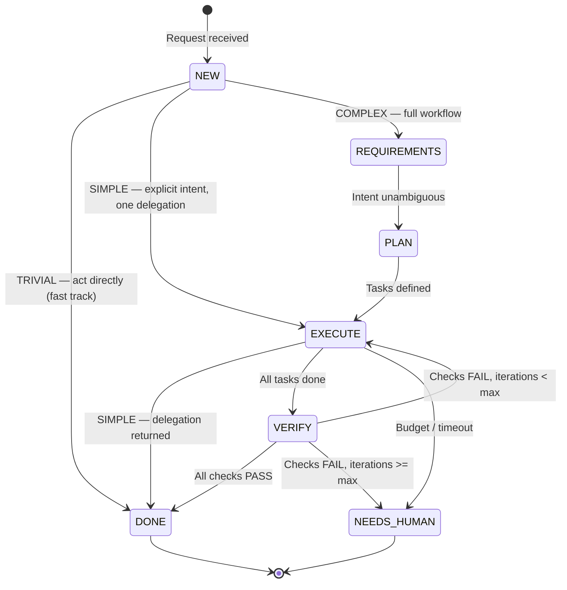
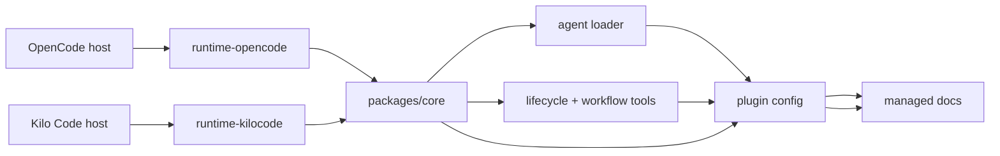

# tori-agent

`tori-agent` is a deterministic agent stack for [OpenCode](https://opencode.ai) and Kilo Code.
It orchestrates work through a workflow/state-machine model: Requirements → Planning → Execution → Verification → Delivery.

Instead of chaining agents ad-hoc, tori runs deterministic pipelines where agents are interchangeable workers and the workflow stays stable, observable, and bounded.

“tori” means frog in Bambara, my native language. The project started from [`opencode-team-lead`](https://github.com/azrod/opencode-team-lead) by azrod, then was adapted into something portable and easy to customize for day-to-day use in OpenCode and Kilo Code.

## The workflow model

The core idea: orchestrate stages, not agents.

| Concept | Role |
|---------|------|
| **Workflow** | A recipe — which stages run, in what order, with what guards |
| **Stage** | A fixed phase in the pipeline (Requirements, Planning, Execution, Verification, Delivery) |
| **Task** | A unit of work within a stage. Tasks in the same stage run in parallel |
| **Agent** | A worker that executes exactly one task. Never receives a full workflow |

### Built-in workflows

- **Implement feature** — Requirements → Planning → Execution → Verification → Delivery
- **Bug fix** — Requirements → Execution → Verification → Delivery
- **Code review** — Requirements → Verification → Delivery
- **Documentation** — Requirements → Execution → Delivery
- **Architecture proposal** — Requirements → Planning → Delivery

### State machine



Tori scales effort to complexity: trivial asks are executed directly and clear tasks get a single delegation (fast track); the full pipeline applies to complex missions. TRIVIAL/SIMPLE transitions are conceptual — no workflow is created at those levels. See `packages/core/spec/prompts/tori.md` (Effort Scaling).

### Guards

- Max verify iterations: **2**
- Task budget: **250k tokens** or **20 tool calls**
- Task timeout: **20 minutes**
- Max delegation depth: **1** (Tori → Specialist)

## Built-in agents

- `Tori` — orchestrates workflows and manages stage transitions
- `Specialist` — executes single tasks with guards (budget, time, depth)
- `Scribe` — generates artifacts at each stage (specs, plans, summaries)

`Specialist` is set up through personas for focused domains such as TypeScript, Terraform, Security, or Performance.

## What tori does

- keeps agent specs and prompts in one source of truth
- uses `tori` as the workflow orchestrator for running deterministic pipelines
- adds specialized personas through `Specialist` for task execution
- ships thin runtime wrappers for OpenCode and Kilo Code

```
core specs/prompts → tori orchestrator → Specialist personas → OpenCode | Kilo Code
```

## What's in the repo

- `packages/core` — shared source of truth for agent specs, prompts, and core logic
- `packages/runtime-opencode` — OpenCode runtime wrapper
- `packages/runtime-kilocode` — Kilo Code runtime wrapper
- `packages/cli` — CLI package (`generate` command implemented, `serve`/`doctor` pending)
- `docs/specs`, `docs/exec-plans`, `docs/briefs`, `docs/workflows` — repo artifacts

## Architecture

`tori-agent` is a shared agent stack with thin runtime wrappers.
`packages/core` owns the shared behavior, while OpenCode and Kilo Code only adapt that core plugin to their host SDKs.



### Components and responsibilities

- `packages/core` — source of truth for shared logic, agent specs, prompts, and plugin assembly.
- `packages/core/src/plugin/index.ts` — builds the plugin object via `buildPlugin()`.
- `packages/core/src/codegen/loader.ts` — loads YAML agent specs from `packages/core/spec/agents/*.yaml` and prompt files from `packages/core/spec/prompts/**`.
- `packages/core/src/tools/lifecycle.ts` — provides lifecycle functions for artifact management (specs, exec-plans, briefs).
- `packages/core/src/tools/workflow.ts` — provides workflow state management (stage transitions, task/check recording).
- `packages/core/src/plugin/tools.ts` — wraps lifecycle and workflow functions as runtime-callable tools.
- `packages/core/src/plugin/agents.ts` — injects compiled agents into host config.
- `packages/runtime-opencode/src/index.ts` and `packages/runtime-kilocode/src/index.ts` — thin wrappers that export `buildPlugin()` from core.
- `packages/runtime-opencode/src/sdk-adapter.ts` and `packages/runtime-kilocode/src/sdk-adapter.ts` — normalize `serverUrl` into `{ baseUrl: new URL(serverUrl) }`.
- `packages/cli` — currently a stub, not a production runtime path.
- `docs/specs`, `docs/exec-plans`, `docs/briefs`, `docs/workflows` — managed repo artifacts.

### Startup and runtime flow

1. A host runtime loads either runtime wrapper package.
2. The wrapper passes control to `buildPlugin()` in `packages/core`.
3. `buildPlugin()` resolves the project root, loads agents and tools, and assembles the plugin object.
4. The loader reads agent YAML and prompt files from the core spec directories.
5. Lifecycle and workflow tooling is wrapped into runtime-callable tools, and compiled agents are injected into host config.
6. On `session.created`, the plugin bootstraps the managed docs artifact directories.

### Constraints and gotchas

- `packages/core` is authoritative for shared behavior.
- Runtime packages should remain thin adapters.
- `packages/cli` is not a production entrypoint.
- Do not edit generated `dist/` output.
- Managed docs artifacts live under `docs/specs`, `docs/exec-plans`, `docs/briefs`, and `docs/workflows`.

## Project structure

```
packages/
  core/                    # Source of truth for shared logic, specs, prompts
    spec/
      agents/*.yaml        # Agent definitions (permissions, personas, modes)
      prompts/             # System prompts for Tori, Scribe, Specialist personas
      skills/              # Bundled skills (spec-writer)
    src/
      codegen/             # Agent spec loader and compiler
      plugin/              # Plugin assembly (agents, tools, events)
      tools/               # Lifecycle + workflow state management
  runtime-opencode/        # OpenCode adapter (thin wrapper)
  runtime-kilocode/        # Kilo Code adapter (thin wrapper)
  cli/                     # CLI stub (not yet production-ready)
docs/
  specs/                   # Agent specification artifacts
  exec-plans/              # Execution plan artifacts
  briefs/                  # Project brief artifacts
  workflows/               # Workflow state artifacts
```

## Requirements

- Node.js 18+
- ESM / NodeNext

## Install

```bash
npm install
```

## Development

- make changes in `packages/core` first; it owns shared agent behavior
- update the runtime wrapper you need after changing shared logic
- keep generated files out of version control; `dist/` is build output

## Build

```bash
npm run build
```

Note: `packages/cli` builds separately.

```bash
npm run build -w packages/cli
```

## Test and lint

```bash
npm test
npm run lint
```

## Contribution rules

### Where to make changes

1. **Shared behavior** — always start in `packages/core`
2. **Runtime adapters** — update after core changes are validated
3. **Agent specs and prompts** — live in `packages/core/spec/agents/*.yaml` and `packages/core/spec/prompts/**`
4. **Repo artifacts** — managed under `docs/specs`, `docs/exec-plans`, `docs/briefs`, `docs/workflows`

### What not to touch

- `dist/` — generated build output, never edit directly
- Generated artifacts in `docs/` that are managed by workflow tools

### Permissions model

Agent specs use a default-deny permissions model. Every permission needs a "why" in the spec:

- `allow` — explicitly granted tools
- `deny` — explicitly blocked tools
- `allow_paths` — tool + path restrictions
- `allow_commands` — tool + command restrictions

When adding a new permission to an agent, document the rationale in the agent's YAML description or spec file.

### Prompt conventions

- Prompts are markdown files loaded at runtime
- Use the delegation template for all subagent prompts
- Keep prompts deterministic: avoid open-ended instructions that could drift
- Reference the workflow model (stages, tasks, agents) rather than ad-hoc phase names

## PR checklist

Before opening a PR:

1. [ ] Changes are limited to the smallest sane scope
2. [ ] `packages/core` changes are made first, runtime wrappers updated after
3. [ ] `npm run build` passes
4. [ ] `npm test` passes
5. [ ] `npm run lint` passes
6. [ ] `node packages/core/tests/verify-expansion.mjs` confirms all agents compile
7. [ ] README and ARCHITECTURE are updated if behavior changed
8. [ ] Agent specs/prompts are consistent with the workflow model

## Git hooks

Install the tracked hooks:

```bash
.git-hooks/install.sh
```

## Questions

Open an issue or reach out directly. The project is maintained by [dimahc](https://github.com/dimahc).
